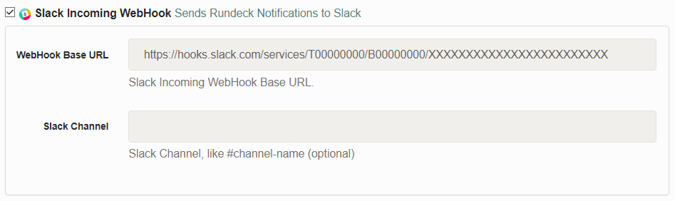
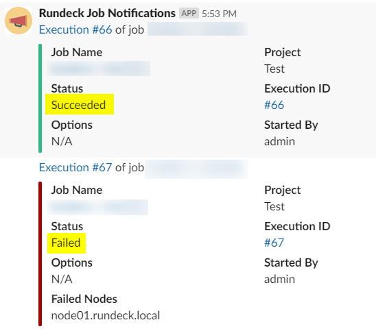

rundeck-slack-incoming-webhook-plugin
======================

Sends rundeck notification messages to a slack channel.  This plugin  is based on [rundeck-slack-plugin](https://github.com/rundeck-plugins/slack-incoming-webhook-plugin).

Difference - added additional config keys: username & icon_emoji

Installation Instructions
-------------------------
## Download jarfile

1. Download jarfile from [releases](https://github.com/GloomyDay/slack-incoming-webhook-plugin/releases).
2. copy jarfile to `$RDECK_BASE/libext`

## Build

1. build the source by gradle.
2. copy jarfile to `$RDECK_BASE/libext`

## Configuration
This plugin uses Slack incoming-webhooks. Create a new webhook and copy the provided url.

The only required configuration settings are:

- `WebHook URL`: Slack incoming-webhook URL.

## Slack message example.

## Contributors
*  Original [hbakkum/rundeck-hipchat-plugin](https://github.com/hbakkum/rundeck-hipchat-plugin) author: Hayden Bakkum @hbakkum
*  Original [bitplaces/rundeck-slack-plugin](https://github.com/bitplaces/rundeck-slack-plugin) authors
    *  @totallyunknown
    *  @notandy
    *  @lusis
* Original [rundeck-plugins/slack-incoming-webhook-plugin](https://github.com/rundeck-plugins/slack-incoming-webhook-plugin) authors
    *  @sawanoboly
* @GloomyDay